# MiniCode

MiniCode 是一个最小可运行的 coding agent 框架。当前阶段的目标不是一次性做完整智能体，而是先把核心 runtime 跑通：

- LLM：DeepSeek API
- Sandbox：Docker CLI
- Agent loop：模型返回 JSON action，系统执行 tool，再把 observation 回传给模型
- 可观测性：结构化 run log、token、耗时、权限决策、文件修改记录
- Eval：内置一组简单任务，用来衡量后续 Skill、Memory、自我进化是否真的有效

后续还会继续扩展 context、harness、memory、skills 和 memory trigger。

## 运行要求

- Python 3.11+
- Docker
- DeepSeek API Key
- Python dependencies: `rich`、`prompt_toolkit`

## 快速开始

```powershell
$env:DEEPSEEK_API_KEY = "sk-..."
python -m pip install -e .
python -m minicode --check
python -m minicode "inspect the workspace and create a hello.txt file"
python -m minicode --chat
```

安装为 editable package 后，也可以直接运行：

```powershell
minicode "inspect the workspace and create a hello.txt file"
```

持续对话模式：

```powershell
python -m minicode --chat
python -m minicode --chat "先看一下项目结构"
```

`--chat` 会启动一个持续 session。每次输入都会触发一轮 agent loop，但 messages、context artifacts、structured notes 和文件修改快照会保留到下一轮。输入 `/exit`、`/quit` 或 Ctrl+Z 后退出，退出时写一份 session run log，并在 session 结束时统一做 memory sedimentation / dreaming。

当前交互式前端支持：

- 基础命令：`/help`、`/resume`、`/sessions`、`/status`、`/exit`、`/quit`。
- 输入体验：优先使用 `prompt_toolkit` 保存历史到 `.minicode/chat-history.txt`，不可用时退回普通 `input()`。
- 实时执行状态：`CodingSession.iter_turn()` 输出事件流，UI 会显示 turn、skill route、policy、step、model action、tool result 和 context compaction。
- 等待反馈：模型调用和 tool 执行期间显示 spinner，并在完成后展示耗时。
- 结构化 trace：按 `Turn` / `Step` 分块展示，区分 `model`、`tool`、`result`、`stdout/stderr preview`，不再把完整最终回答塞进 trace。
- 结果分区：最终回答只显示在单独的 `Answer` 区块中。
- 流式响应：`--chat` 默认使用 DeepSeek streaming；如果网关不支持会自动 fallback。可用 `--no-stream` 关闭。

恢复和管理历史对话：

```text
/resume
/resume .minicode/runs/20260621-221530-run_xxx.json
/resume .minicode/runs
/sessions
/sessions delete 3
/sessions delete .minicode/runs/20260621-221530-run_xxx.json
```

`/resume` 不带参数时，会列出当前 `--run-log` 指向目录里的历史 session 记录；`/resume 目录` 会列出该目录下的记录；`/resume 文件.json` 会直接恢复指定 run log。选择式恢复时，输入列表里的编号即可进入对应历史上下文。恢复时不会重新执行旧工具调用，而是把旧 session 的 user/answer、最近 tool trace、policy intents 和 context metadata 压缩成一段背景上下文注入当前 session。恢复后下一次输入会带着这段历史继续对话；如果需要确认当前文件状态，模型仍应重新调用 file tools。

`/sessions` 用来列出保存过的 session；`/sessions delete <编号|文件>` 会删除对应 session。删除采用软删除：run log 会移动到 `.minicode/runs/_deleted/`，关联 memory 会移动到 `.minicode/memory/_archive/`，因此不会再出现在 `/resume`、`search_memory` 和 active memory index 里。关联 memory 的判断基于 `run_id`、`source_run_id`、`source_trace_ids` 和 `parent_memory_ids` 链路：直接 session memory、由该 session 沉淀出的长期 memory、以及 dreaming 后仍带有该 session 父链路的融合 memory 都会被一起归档。

trace 示例：

```text
Turn 1
  skills  none (none)
  policy  workspace_structure, rules=3, first=list_files

Step 1
  model   list_files  tokens=1057, 6037ms
    args    {"limit": 200, "max_depth": 2, "path": "."}
  tool    list_files
  result  OK list_files  exit=0, 0ms
    stdout  .env, .env.example, .gitignore, README.md, pyproject.toml, ...

Step 2
  model   finish  tokens=2011, 9086ms
```

## Agent Loop

单任务模式：

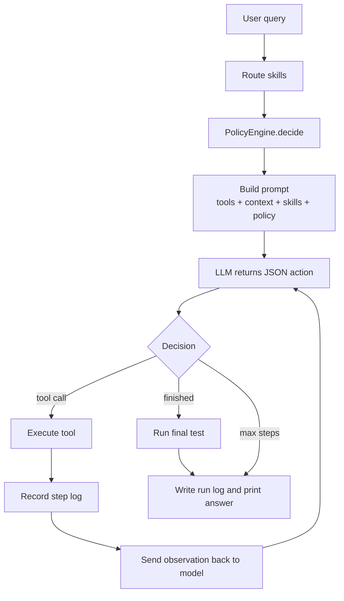

持续对话模式：

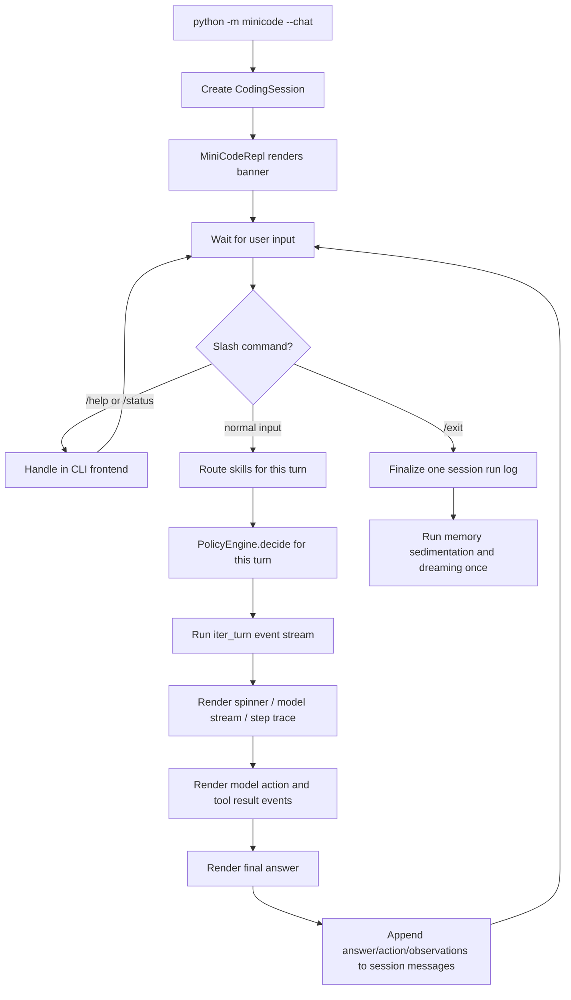

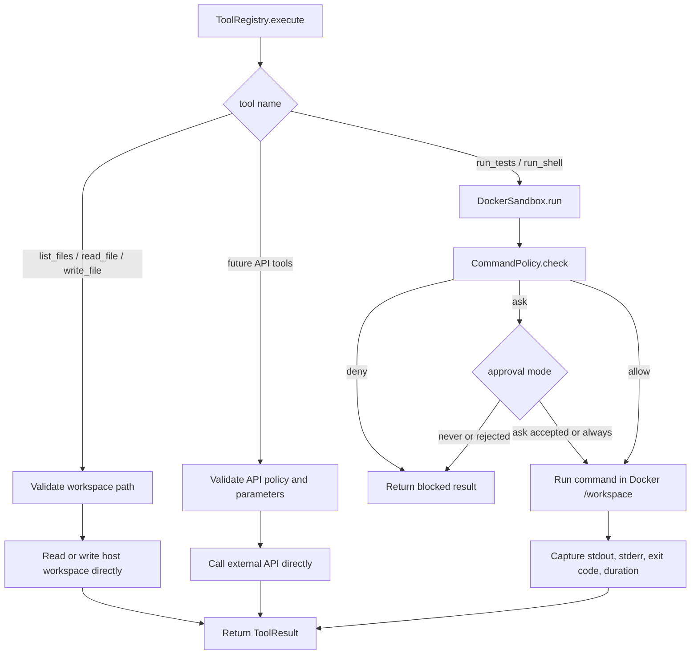

第一张图是单任务 agent 主循环：用户任务进入后，MiniCode 先做 skill route 和 policy 决策，再构建 prompt；DeepSeek 返回一个 JSON action，系统执行对应 tool，并把 observation 再发回模型，直到模型返回 `finish` 或达到最大步数。

第二张图是持续对话 session：外层 session loop 接收多次用户输入，每个 turn 都会重新做 skill route 和 policy 决策；同一个 session 保留上下文，退出时统一写 session run log 和 memory。

第三张图是 tool 执行路径：不是所有 tool 都走 Docker。文件类 tool 直接在本地 workspace 内执行路径校验和读写；`run_shell` / `run_tests` 才会进入 Docker sandbox；未来 API 类 tool 会走自己的 API 参数校验和权限策略。

## 干预链路

干预链路是模型调用前的一层 `Policy Layer`。它不是某个 tool 的硬编码 guard，也不是执行后再拦截模型；它会先读取当前 user query，生成本轮的结构化策略，然后把策略渲染进本轮 user message。

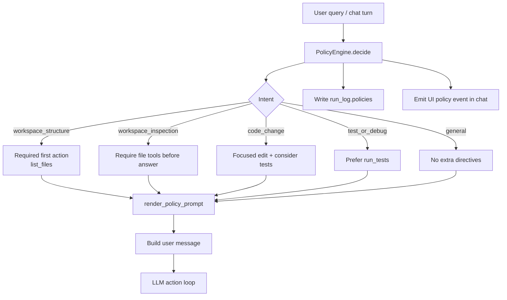

当前实现位置：

- `minicode/policy.py`：定义 `PolicyEngine`、`PolicyDecision`、`RequiredAction` 和 `render_policy_prompt()`。
- `minicode/prompts.py`：构造 task / turn message 时注入 policy 文本。
- `minicode/runtime.py`：单任务运行开始时生成一次 policy，并写入 `run_log.policies`。
- `minicode/session.py`：交互式每个 turn 都生成一次 policy，并发送 `policy` UI event。
- `minicode/ui/render.py`：在 trace 中显示本轮 policy，例如 `policy workspace_structure, rules=3, first=list_files`。

第一版规则：

- 项目结构 / 目录结构类请求：强制下一步先调用 `list_files`，即使 initial context 里已经有文件索引。
- 工作区检查 / 分析类请求：要求先使用文件类 tools，不要只凭 memory 或 initial context 回答文件内容。
- 代码修改类请求：要求聚焦本次修改；修改后如果有合适命令，应运行相关测试，或者说明为什么没跑。
- 测试 / 调试类请求：优先使用 `run_tests`，只有 `run_tests` 不适合时才用 `run_shell`。

模型实际看到的是本轮 user message 中的一段 `Policy directives for this turn`。例如项目结构请求会注入：

```text
Policy directives for this turn:
- Detected intent: workspace_structure
- Required first action:
  {"action":"list_files","args":{"path":".","max_depth":2,"limit":200}}
  Reason: The user asked about the current project or directory structure.
- Rules:
  - Call list_files as the next action before finish or any other action.
  - Use fresh tool output even if Initial context already contains a file index.
  - Do not invent files that were not returned by tools.
```

## 项目文件架构

```text
MiniCode/
  pyproject.toml
  README.md
  .env.example
  .gitignore
  .skills/
    python_test_repair.md
    add_api.md
    refactor_function.md
    input_validation.md
    code_review.md
  minicode/
    __main__.py
    __init__.py
    cli.py
    agent.py
    runtime.py
    session.py
    action_parser.py
    prompts.py
    policy.py
    resume.py
    llm.py
    tools.py
    sandbox.py
    permissions.py
    context.py
    observability.py
    eval.py
    harness.py
    memory.py
    dreaming.py
    ui/
      __init__.py
      commands.py
      render.py
      repl.py
    retrieval/
      __init__.py
      schema.py
      ranking.py
      skill.py
      memory.py
    skills/
      __init__.py
      schema.py
      loader.py
      catalog.py
      router.py
      prompt.py
    memory_trigger.py
```

- `pyproject.toml`：Python 项目配置，定义包名、版本、Python 版本要求和 `minicode` 命令行入口。
- `.env.example`：环境变量示例，包含 DeepSeek、Docker、日志和 eval 相关配置。
- `.skills/`：Skill 内容库。这里的 Markdown 文件是给模型看的任务工作流说明，不是 Python 执行代码。
- `.gitignore`：忽略 `.minicode/`、Python 缓存和安装元数据。`.minicode/` 是本机持久运行数据目录，但默认不提交到 Git。
- `minicode/__main__.py`：支持 `python -m minicode` 的入口文件，只负责转发到 CLI。
- `minicode/cli.py`：命令行入口，解析参数，创建 `DeepSeekClient`、`DockerSandbox`、`CodingAgent`，并处理 `--check`、`--eval`、`--chat`、`--run-log` 等模式。
- `minicode/agent.py`：`CodingAgent` 组装入口，负责持有 LLM、sandbox、tools、skill catalog、memory store 和运行配置。
- `minicode/runtime.py`：单任务 agent loop。负责构造 prompt、执行 action/tool 循环、记录 step log，并在结束时 finalize。
- `minicode/session.py`：持续对话 session。负责多轮用户输入共享同一份 messages/context，`iter_turn()` 输出实时 UI events，并在 session 关闭时统一 finalize。
- `minicode/action_parser.py`：解析模型返回的 JSON action，并从 `finish` action 中提取最终回答。
- `minicode/prompts.py`：构建 system prompt、单任务 user message 和多轮对话 turn message。
- `minicode/policy.py`：统一干预链路。根据当前 user query 生成本轮策略，例如强制先 `list_files`、要求先查文件、修改后考虑测试等。
- `minicode/resume.py`：历史对话恢复。负责定位 run log、读取 JSON，并把历史 session 压缩成可注入当前上下文的 resume context。
- `minicode/llm.py`：DeepSeek API client。调用 OpenAI-compatible `/chat/completions`，返回模型内容、token 用量和耗时。
- `minicode/tools.py`：Tool runtime。注册并执行当前支持的 tools，统一返回 `ToolResult`。
- `minicode/sandbox.py`：Docker sandbox。负责把命令放进 Docker 的 `/workspace` 中执行，并收集 stdout、stderr、exit code、耗时和权限信息。
- `minicode/permissions.py`：命令权限策略。对危险命令做 `allow`、`ask`、`deny` 判断，并支持 `never`、`ask`、`always` 三种审批模式。
- `minicode/context.py`：多层上下文构建与压缩。负责 L0-L3 层说明、初始文件索引、大 observation 外置、占位预览、结构化 notes 和历史超限压缩。
- `minicode/ui/repl.py`：交互式 CLI 前端。负责 `--chat` REPL、输入历史、slash command 分发、消费 `iter_turn()` 事件流和 session 保存。
- `minicode/ui/commands.py`：解析 `/help`、`/status`、`/exit` 等 slash commands。
- `minicode/ui/render.py`：终端输出渲染。优先使用 `rich`，不可用时退回普通文本。
- `minicode/observability.py`：结构化日志模型。记录每一步的模型输入摘要、action、tool 参数、权限决策、输出、修改文件、token、耗时和 retrieval trace。
- `minicode/eval.py`：内置 eval 任务集和指标汇总。用于衡量任务成功率、测试通过率、tool 调用次数、危险命令等。
- `minicode/harness.py`：后续 harness 占位。未来用于自动判断项目类型、运行验证命令和驱动修复循环。
- `minicode/memory.py`：文件型 memory store。管理 `.minicode/memory` 下的 Markdown/Text 记忆，支持检索、写入、归档和索引更新。
- `minicode/dreaming.py`：离线 memory dreaming。负责判断触发条件、精确去重、调用 DeepSeek 合并摘要，并把旧长期记忆归档。
- `minicode/retrieval/`：统一检索基础层。提供 `RetrievalCandidate`、`RetrievalResult`、`RetrievalTrace` 等共享结构；`search_skills` 和 `search_memory` 的 action 仍然分开，但底层共享检索 trace 结构。
- `minicode/skills/schema.py`：定义 `Skill`、`SelectedSkill`、`SkillRoute` 等数据结构。
- `minicode/skills/loader.py`：读取 `.skills/*.md`，解析 frontmatter 和正文。
- `minicode/skills/catalog.py`：管理已加载的 skill，提供按名称查询和枚举能力。
- `minicode/skills/router.py`：Skill 路由入口。复用 `SkillToolRetriever` 做元信息粗召回和 DeepSeek 精排，再把 selected skills 转成 `SkillRoute`。
- `minicode/skills/prompt.py`：把选中的 skill 渲染成 prompt 文本，注入给模型。
- `minicode/memory_trigger.py`：记忆沉淀触发器。当前实现“session 摘要 -> 规则信号初筛 -> DeepSeek 长期记忆分类 -> 写入 memory”。

## Skill 体系

Skill 是给模型看的工作手册，不是可执行函数。Tool 负责真正执行动作，Skill 负责指导模型按什么步骤使用 tools。

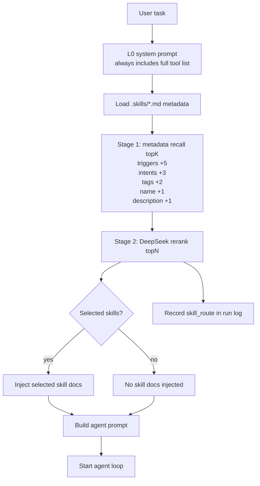

当前 skill 检索是“底层统一，入口分开”：

- 底层统一在 `SkillToolRetriever`：先用 `MetadataSkillRetriever` 做元信息粗召回，再用 `LlmSkillRanker` 调 DeepSeek 精排；如果 LLM 精排失败，回退到本地规则精排。
- 自动 route 入口：`TwoStageSkillRouter.route(task)` 调用 `SkillToolRetriever.retrieve(task, limit=max_skills)`，把 `selected` 转成 `SkillRoute`，再由 `render_skill_prompt()` 注入当前 task / chat turn。
- Tool 入口：模型在 agent loop 内调用 `search_skills` 时，也调用同一个 `SkillToolRetriever.retrieve(query, limit)`，但返回形式是 tool observation，并写入 step log 的 `retrieval_trace`。
- 两个入口的检索结果结构一致：`recalled`、`selected`、`rejected`、`intent`、`reranker`、`rerank_token_usage`、`rerank_error`、`retrieval_trace`。
- 两个入口的区别只在消费方式：自动 route 把 selected skills 变成 prompt；`search_skills` 把 selected skills 变成 observation，后续可用 `load_skill` 加载完整 workflow。
- 默认自动 route 最多注入 `2` 个 skill，可用 `--max-skills` 调整；默认粗召回 `8` 个候选，可用 `--skill-recall-k` 调整。
- 完整 tool list 不属于 skill route，它常驻在 L0 system prompt；没有命中 skill 时，只是不额外注入 skill 文档，模型仍然能调用全部 tools。
- run log 会记录 `skill_route.recalled`、`skill_route.selected`、`skill_route.retrieval_trace`、`reranker` 和精排 token 用量，方便后续 eval 对比 skill 是否有效。

**统一 Retriever**

当前没有合并模型可见的检索 action，模型仍然分别调用 `search_skills` 和 `search_memory`。底层新增 `minicode/retrieval/` 作为共享检索基础层，统一候选、结果、阶段和 trace 的数据结构。

```text
search_skills -> SkillToolRetriever  -> RetrievalTrace(kind=skill)
search_memory -> MemoryToolRetriever -> RetrievalTrace(kind=memory)
```

- `schema.py`：定义 `RetrievalCandidate`、`RetrievalResult`、`RetrievalStage`、`RetrievalTrace`。
- `skill.py`：统一 skill 检索底层。先做 metadata 粗召回，再做 DeepSeek 精排；自动 route 和 `search_skills` tool 都复用它。
- `memory.py`：实现 memory 检索三阶段：关键词粗召回、动态加权、本地 topK 后交给 DeepSeek 精排；如果 LLM 精排失败，会退回本地加权结果。
- `ranking.py`：放通用文本规范化和 reason 处理。
- 每次 `search_skills` / `search_memory` 的结果都会写入 step log 的 `retrieval_trace`，方便后续 eval 对比检索质量。

Skill 检索召回与精排流程：

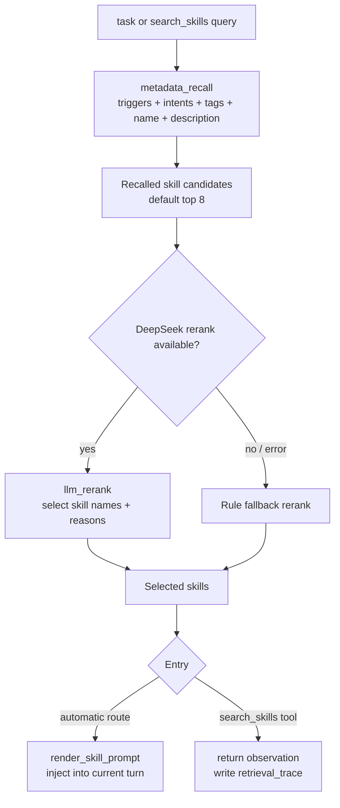

入口说明：

- 自动 route：发生在单任务运行开始前，或 `--chat` 每个用户 turn 开始前。它不暴露给模型，属于系统主动为当前任务挑选少量 skill。
- `search_skills` tool：发生在 agent loop 内。模型已经知道完整 tool list，因此可以主动搜索 skill；搜索结果仍然来自同一个 `SkillToolRetriever`。
- `load_skill` tool：不参与检索排序，只负责按名称读取某个 skill 的正文，并作为 observation 加入后续上下文。

Memory 检索召回与精排流程：

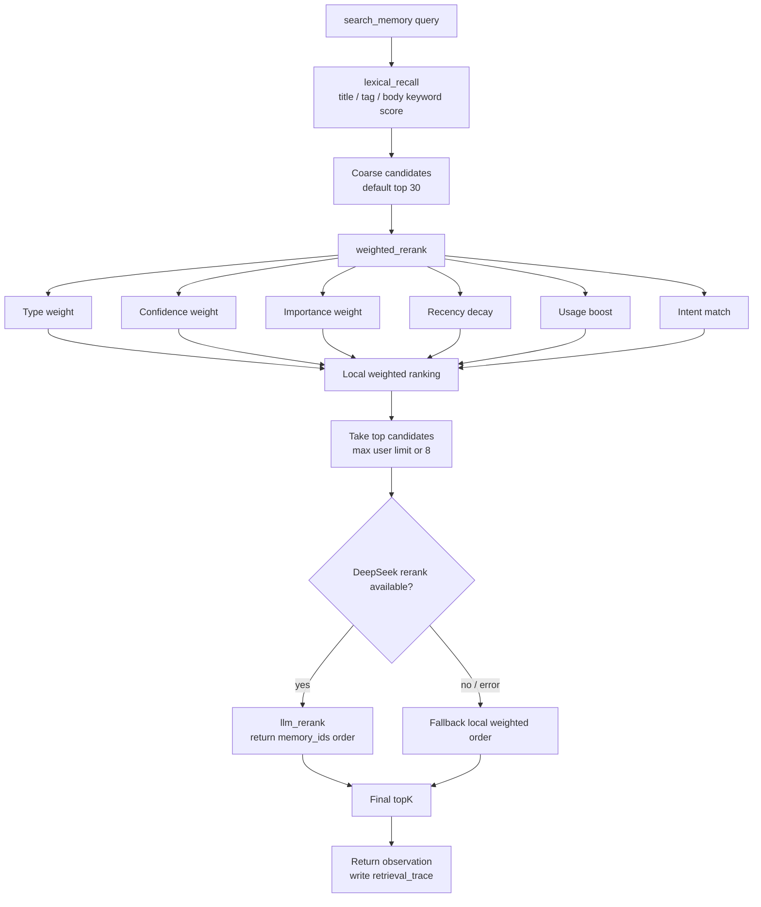

本地加权规则：

- 原始分数：来自 `FileMemoryStore.search()` 的关键词粗召回，主要看 title、tag、body 是否命中 query。
- 本地加权公式：`weighted_score = raw_score * type * confidence * importance * recency * usage * intent`。
- `type`：`experience_memory=1.25`，`procedural_memory=1.15`，`project_memory=1.10`，`session_summary=0.75`，原始 `session_memory=0.55`。
- `confidence`：`0.5 + 0.5 * confidence`，缺省按 `0.7` 处理。
- `importance`：`0.7 + 0.3 * importance`。
- `recency`：按记忆类型使用不同半衰期；原始 session 为 `3` 天且最低 `0.15`，session summary 为 `14` 天且最低 `0.35`，project 为 `180` 天且最低 `0.65`，procedural 为 `90` 天且最低 `0.65`，experience 为 `365` 天且最低 `0.70`。
- `usage`：`1 + min(log1p(usage_count) * 0.08, 0.30)`，常被加载的 memory 会小幅上升。
- `intent`：根据 query 意图做轻量提升；项目/架构类 query 提升 project，流程/修复/测试类 query 提升 procedural，偏好/风格类 query 提升 experience，最近/刚才/session 类 query 提升 session。
- 本地加权后只把少量 top candidates 交给 DeepSeek 精排；如果 DeepSeek 不可用或返回异常，就退回本地加权排序。

LLM 精排逻辑：

- 输入：query、limit，以及本地 top candidates 的 `memory_id`、type、subtype、title、tags、body preview、base score、weighted score、weights 和 reasons。
- 输出：DeepSeek 只允许返回候选里的 `memory_ids` 顺序和一个简短 `reason`，不能生成新的 memory id。
- 过滤：MiniCode 会丢弃不在候选集里的 id；如果 LLM 返回数量不足，会用本地加权顺序补齐。
- 回退：如果 DeepSeek 不可用、返回空结果或 JSON 解析失败，直接使用本地加权排序。
- 观测：`retrieval_trace` 会记录 `candidate_ids`、`ranked_ids`、`selected_ids`、LLM `reason`、token 用量和错误信息。

`search_memory` 会把粗召回、本地加权和 LLM 精排写入 `retrieval_trace`。`load_memory` 成功后会更新该 memory 的 `usage_count` 和 `last_used_at`，后续检索会略微提升常用 memory。

## 多层 Context

当前 context 设计为 L0-L3。前三层在第一次调用模型前构造，L3 在 agent loop 中持续更新。

Agent loop 中的 context 工作流程：

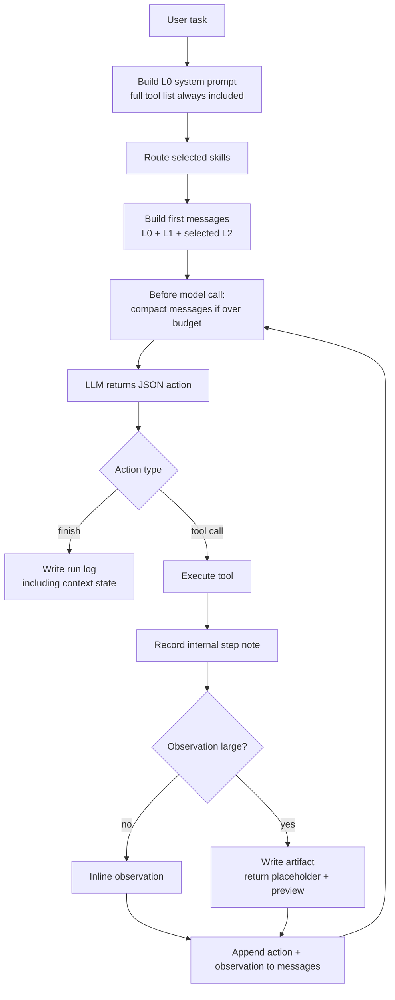

L0-L3 分层架构：

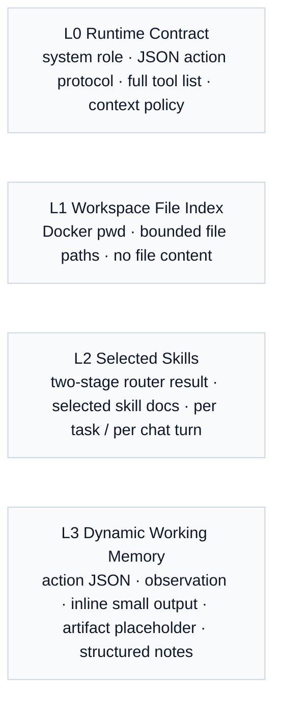

层级说明：

- `L0 runtime contract`：固定系统规则、JSON action 协议、完整 tool list 和 context 使用策略。它在 system prompt 中常驻，每次模型调用都会带上。
- `L1 workspace file index`：运行开始时在 Docker `/workspace` 里读取当前工作目录和最多 200 个文件路径，不包含文件内容。
- `L2 selected skills`：通过两阶段 skill router 选择少量 skill 注入 prompt。单任务模式在运行开始前选择；`--chat` 模式每个用户 turn 开始前重新选择。
- `L3 dynamic working memory`：agent loop 中持续更新的动态上下文，只包含完整 action JSON 和 observation。`read_file`、`run_tests`、`load_skill`、`load_memory`、`read_context_artifact` 等 tool 的返回内容都只是 observation 的不同来源。

当前策略：

- tool 执行后先处理本次 observation：小结果直接 inline，大结果写入 artifact 后用占位符和预览替换。
- 模型调用前检查整段 messages：如果超过 `MINICODE_CONTEXT_HISTORY_CHAR_LIMIT`，早期 action / observation 会脱离成 structured notes。
- artifact 占位符不是单独的 context 类型，它是大 observation 被外置后留在 observation 里的引用。notes 也不是单独的 context 类型，它是旧 action / observation 被移出 prompt 后的摘要。
- 大 observation 的原文会保存在 `.minicode/context-artifacts`，后续可通过 `read_context_artifact` 按行读回。
- 小 observation 当前不会额外写 artifact；如果后续历史超限，它会从 prompt 原文中脱离，只在 notes 中保留摘要。
- memory 默认来自 `.minicode/memory` 下的 `.md` / `.txt` 文件；任务结束后会自动沉淀 `session_memory`，命中规则后再沉淀长期记忆。
- run log 的 `context` 字段会记录 context layers、artifact、notes、compaction 事件。

## 记忆触发闭环

当前实现包含两段：在线记忆沉淀和第一版离线 dreaming。记忆沉淀发生在一次 agent run 结束之后，不在每个 step 后触发；dreaming 在沉淀之后做阈值检查，命中后才整理已有 memory。

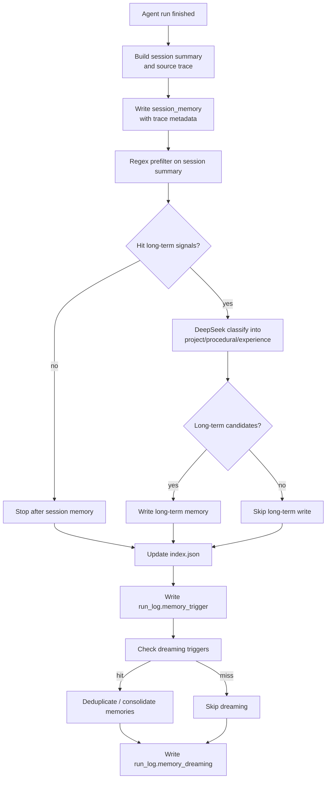

四类记忆：

- `session_memory`：session 层记忆。原始 run 摘要记录任务、结果、关键文件、工具使用和测试状态；dreaming 后也可以生成 `subtype=session_summary` 的压缩 session 摘要。
- `project_memory`：项目事实、架构约定、文件组织、设计决策。
- `procedural_memory`：可复用的修复流程、测试流程、工具使用经验。
- `experience_memory`：明确表达过的协作经验和稳定工作偏好。

当前执行逻辑：

- run 结束后，`MemoryTrigger` 先生成一条本地 `session_memory` 摘要。
- `session_memory` 会先写入 `.minicode/memory/sessions/`，保证每次 run 都有可检索的情景记录。
- 然后 MiniCode 只对这条 session 摘要做正则初筛，判断是否出现长期沉淀信号。
- 规则信号来自 session 摘要里的任务、最终答案、修改文件、tool 使用、测试结果、危险/无效命令等。
- 如果没有命中长期信号，本次记忆沉淀到 session memory 为止，不调用 DeepSeek 做长期分类。
- 如果命中长期信号，DeepSeek 只负责把 session 摘要精判并分类为 `project_memory`、`procedural_memory`、`experience_memory` 三类候选。
- 在线沉淀阶段的原始 `session_memory` 始终由本地摘要生成；dreaming 阶段可以生成 `subtype=session_summary` 的压缩版 session memory。
- 如果 DeepSeek 长期分类失败，已经写入的 `session_memory` 会保留，不会让主任务失败。
- 记忆写入结果会记录到 run log 的 `memory_trigger` 字段；`to_dict()` 会暂时保留兼容字段 `memory_evolution`。
- 每条新 memory 会写入 `source_run_id`、`source_trace_ids`、`source_step_ids`、`source_tool_names`、`source_modified_files` 等来源字段。
- dreaming 生成的 `session_summary` 和长期记忆都会通过 `parent_memory_ids` 指向来源 session，方便回查证据链。

存储结构：

```text
.minicode/memory/
  project/
  procedural/
  experience/
  sessions/
  _archive/
  index.json
  dreaming-state.json
```

写入规则：

- `MINICODE_MEMORY_TRIGGER=on` 是默认模式，会写入 `session_memory`，命中规则后写入长期记忆。
- `MINICODE_MEMORY_TRIGGER=off` 会关闭记忆沉淀。
- 四类记忆都直接写入对应目录，并参与 `search_memory`。
- `session_memory` 始终写入 `sessions/` 目录，并参与 `search_memory`。
- 原始 `session_memory` 当前检索分数乘以 `0.6`，`subtype=session_summary` 乘以 `0.75`，避免 session 层压过长期记忆。
- `index.json` 是记忆目录和元数据索引，记录 `id`、`type`、`subtype`、`title`、`tags`、`path`、`source_run_id`、`source_trace_ids`、`parent_memory_ids`。当前检索仍直接扫描 active Markdown/Text 文件，`index.json` 主要服务人工查看、后续 context memory index 和 dreaming 批处理。

## Dreaming

**四种触发时机**

- 精确重复触发：当前层 eligible memory 中出现完全重复内容。
- 数量阈值触发：当前层 eligible memory 数量达到阈值。
- Token 阈值触发：当前层 eligible memory 估算 token 总量达到阈值。
- 时间间隔触发：已有上次 dreaming 记录，超过配置时间间隔，且当前层存在 eligible memory。

`session_memory` 层只处理超过热窗口的原始 session，数量阈值使用 `MINICODE_DREAM_SESSION_THRESHOLD`，token 阈值使用 `MINICODE_DREAM_SESSION_TOKEN_THRESHOLD`。`project_memory`、`procedural_memory`、`experience_memory` 层使用 `MINICODE_DREAM_MEMORY_THRESHOLD` 和 `MINICODE_DREAM_MEMORY_TOKEN_THRESHOLD`。

**四层 Dreaming 流转**

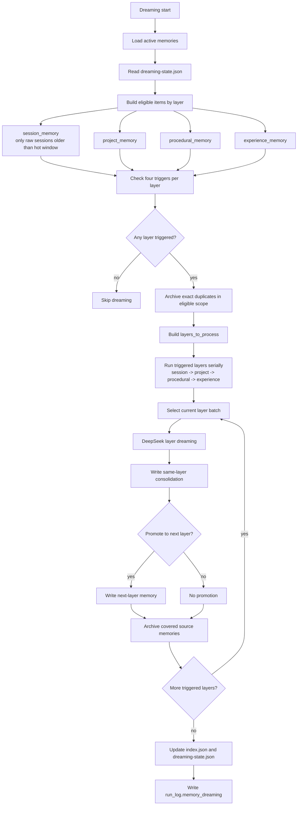

- 触发方式：手动 `python -m minicode --dream` 强制执行；自动模式下在 run 结束后检查阈值。
- 自动触发规则按层计算，四层分别是 `session_memory -> project_memory -> procedural_memory -> experience_memory`。
- 热窗口规则：默认近 `2` 天的原始 `session_memory` 不参与 dreaming、不去重、不归档，继续完整参与检索。
- 处理内容：先本地归档可处理范围内的精确重复 memory；再按层把命中的 batch 交给 DeepSeek 做本层合并、摘要，并判断是否需要向上一层写入本次 dreaming 结果。
- 写入策略：`session_memory` 层可以写入 `subtype=session_summary`，并可判断是否上升为 `project_memory`；`project_memory` 可上升为 `procedural_memory`；`procedural_memory` 可上升为 `experience_memory`；`experience_memory` 是当前最高层，只做本层合并。
- 归档策略：原始旧 session 只有在对应 `session_summary` 成功写入后才归档；被 LLM 合并且完全被新长期记忆覆盖的旧长期 memory 也会归档。普通检索和 `index.json` 不读取 `_archive/`。
- 状态文件：`dreaming-state.json` 记录上次 dreaming 时间、已处理 session id 和已处理 memory id。

## 当前支持的 Tools

模型每轮必须返回一个 JSON object，例如：

```json
{"thought":"short reasoning","action":"list_files","args":{"path":".","max_depth":2}}
```

或者结束任务：

```json
{"thought":"done","action":"finish","args":{"answer":"summary for the user"}}
```

当前 tools：

- `list_files`
  - 参数：`path`、`max_depth`、`limit`
  - 作用：列出 workspace 内文件。
  - 执行位置：本地 host workspace。
  - 安全策略：会校验路径不能逃出 workspace。

- `read_file`
  - 参数：`path`、`start_line`、`limit`
  - 作用：读取文件的指定行范围。
  - 执行位置：本地 host workspace。
  - 安全策略：会校验路径不能逃出 workspace。

- `write_file`
  - 参数：`path`、`content`、`overwrite`
  - 作用：写入文件。默认不覆盖已有文件，除非 `overwrite=true`。
  - 执行位置：本地 host workspace。
  - 安全策略：会校验路径不能逃出 workspace。

- `run_tests`
  - 参数：`command`
  - 默认命令：`python -m pytest`
  - 作用：在 Docker sandbox 中运行测试命令。
  - 执行位置：Docker `/workspace`。
  - 安全策略：先经过 `CommandPolicy`，再决定是否执行。

- `read_context_artifact`
  - 参数：`artifact_id`、`start_line`、`limit`
  - 作用：按行读取被外置化的大型 tool observation。
  - 执行位置：本地 context artifact 存储。
  - 安全策略：只能读取本次运行中由 MiniCode 生成的 artifact id，不能传任意文件路径。

- `search_skills`
  - 参数：`query`、`limit`
  - 作用：在 `.skills/*.md` 中先按元信息粗召回相关 skill，再用 DeepSeek 精排 selected skills；失败时回退本地规则精排。
  - 执行位置：本地 skill catalog。
  - 使用方式：先搜索候选，再用 `load_skill` 加载完整 workflow。

- `load_skill`
  - 参数：`name`、`max_chars`
  - 作用：把指定 skill 的完整说明作为 observation 注入后续上下文。
  - 执行位置：本地 skill catalog。

- `search_memory`
  - 参数：`query`、`limit`
  - 作用：在 `.minicode/memory` 的长期记忆和 `session_memory` 中搜索相关项目经验。
  - 执行位置：本地 memory store。
  - 使用方式：先搜索候选，再用 `load_memory` 加载完整记忆。

- `load_memory`
  - 参数：`memory_id`、`max_chars`
  - 作用：把指定 memory 作为 observation 注入后续上下文。
  - 执行位置：本地 memory store。

- `run_shell`
  - 参数：`command`
  - 作用：兜底 shell tool，用于结构化 tool 不够用的情况。
  - 执行位置：Docker `/workspace`。
  - 安全策略：先经过 `CommandPolicy`，危险命令会被拒绝或要求审批。

- `finish`
  - 参数：`answer`
  - 作用：结束 agent loop，返回最终答案。
  - 执行位置：不执行外部操作。

## 配置

环境变量：

- `MINICODE_MODEL`：DeepSeek 模型名，默认 `deepseek-v4-flash`
- `DEEPSEEK_API_KEY`：DeepSeek API Key
- `MINICODE_DEEPSEEK_URL`：DeepSeek API base URL，默认 `https://api.deepseek.com`
- `MINICODE_LLM_TIMEOUT`：单次 LLM 响应超时时间，默认 `120`
- `MINICODE_MAX_TOKENS`：API provider 的最大输出 token，默认 `4096`
- `MINICODE_WORKSPACE`：挂载到 Docker 的 workspace，默认当前目录
- `MINICODE_DOCKER_IMAGE`：sandbox 镜像，默认 `python:3.12-slim`
- `MINICODE_MAX_STEPS`：agent 最大循环步数，默认 `8`
- `MINICODE_APPROVAL`：风险命令审批模式，默认 `never`
- `MINICODE_RUN_LOG`：结构化运行日志输出目录或文件路径，默认 `.minicode/runs`
- `MINICODE_FINAL_TEST_COMMAND`：agent 结束后运行的最终测试命令
- `MINICODE_EVAL_OUTPUT`：eval 报告输出路径，默认 `.minicode/eval-report.json`
- `MINICODE_SKILLS_DIR`：Skill Markdown 目录，默认 `.skills`
- `MINICODE_MAX_SKILLS`：每次最多注入的 skill 数量，默认 `2`
- `MINICODE_SKILL_RECALL_K`：精排前粗召回的 skill 候选数量，默认 `8`
- `MINICODE_CONTEXT_ARTIFACT_DIR`：大 observation 外置存储目录，默认 `.minicode/context-artifacts`
- `MINICODE_OBSERVATION_INLINE_LIMIT`：tool observation 小于等于该字符数时直接进入上下文，默认 `6000`
- `MINICODE_OBSERVATION_PREVIEW_CHARS`：大 observation 外置后保留在 prompt 中的预览字符数，默认 `1200`
- `MINICODE_CONTEXT_HISTORY_CHAR_LIMIT`：消息历史超过该字符数后触发脱离压缩，默认 `24000`
- `MINICODE_CONTEXT_KEEP_RECENT_MESSAGES`：历史脱离时保留最近消息数，默认 `6`
- `MINICODE_CONTEXT_NOTE_CHAR_LIMIT`：结构化 notes 摘要最大字符数，默认 `6000`
- `MINICODE_MEMORY_DIR`：本地 memory Markdown/Text 目录，默认 `.minicode/memory`
- `MINICODE_MEMORY_TRIGGER`：记忆沉淀模式，`off` / `on`，默认 `on`
- `MINICODE_MEMORY_MIN_CONFIDENCE`：候选记忆最低置信度，默认 `0.7`
- `MINICODE_MEMORY_MAX_CANDIDATES`：每次反思最多生成的候选记忆数，默认 `5`
- `MINICODE_DREAMING`：run 结束后的 dreaming 模式，`off` / `auto`，默认 `auto`
- `MINICODE_DREAM_SESSION_THRESHOLD`：新增多少条 `session_memory` 后自动触发 dreaming，默认 `8`
- `MINICODE_DREAM_SESSION_TOKEN_THRESHOLD`：超过热窗口的原始 session memory 估算 token 总量达到多少后触发，默认 `12000`
- `MINICODE_DREAM_MEMORY_THRESHOLD`：单个长期 memory 层新增多少条 active memory 后自动触发 dreaming，默认 `40`
- `MINICODE_DREAM_MEMORY_TOKEN_THRESHOLD`：单个长期 memory 层估算 token 总量达到多少后触发，默认 `12000`
- `MINICODE_DREAM_INTERVAL_HOURS`：距离上次 dreaming 超过多少小时且某层存在 eligible memory 时触发，默认 `24`
- `MINICODE_DREAM_MAX_BATCH_SIZE`：单次 dreaming 最多处理多少条 memory，默认 `20`
- `MINICODE_DREAM_MIN_CONFIDENCE`：dreaming 写入长期记忆的最低置信度，默认 `0.75`
- `MINICODE_DREAM_SESSION_HOT_DAYS`：原始 session memory 保持完整 active 的天数，默认 `2`

示例：

```powershell
$env:MINICODE_MODEL = "deepseek-v4-pro"
python -m minicode "list files"
```

手动执行一次 memory dreaming：

```powershell
python -m minicode --dream
```

审批模式：

- `never`：需要审批的命令直接阻止
- `ask`：在控制台询问是否允许
- `always`：自动允许需要审批的命令

示例：

```powershell
python -m minicode --approval ask "run tests and fix failures"
```

## 运行日志

MiniCode 默认会为每次运行写一个结构化 JSON 日志。日志是本地持久数据，不会因为下一次运行而覆盖。

```powershell
python -m minicode --final-test-command "python -m unittest discover -s tests" "fix the failing test"
```

默认日志目录：

```text
.minicode/runs/
```

日志文件名会包含时间戳和任务摘要，例如：

```text
.minicode/runs/20260621-221530-fix-the-failing-test.json
```

也可以手动指定目录：

```powershell
python -m minicode --run-log .minicode/my-runs "list files"
```

如果手动指定固定文件名，MiniCode 也不会覆盖旧文件，而是自动追加编号：

```text
.minicode/run-log.json
.minicode/run-log-1.json
.minicode/run-log-2.json
```

每一步会记录：

- 模型输入摘要
- 模型生成的 action
- tool 名称和参数
- 权限决策
- stdout、stderr、exit code
- 修改文件
- token 消耗
- 运行耗时
- 是否出现危险或无效命令

每次单任务或每个 chat turn 还会在 `run_log.policies` 中记录本轮干预链路结果，包括识别出的 intent、命中的规则、是否存在 required first action。

如果设置了 `--final-test-command`，最终测试结果也会写入 run log。

## Eval

运行内置 eval：

```powershell
python -m minicode --eval --approval never
```

eval 会在 `.minicode/eval-runs` 下创建隔离 workspace，并统计：

- 任务成功率
- 测试通过率
- 平均 tool 调用次数
- 无效命令次数
- 修改文件数量
- token 用量
- 总耗时
- 危险命令次数

当前 eval 任务：

- 修复一个失败的单元测试
- 补充一个 API
- 修复类型错误
- 重构一个函数
- 增加输入校验
