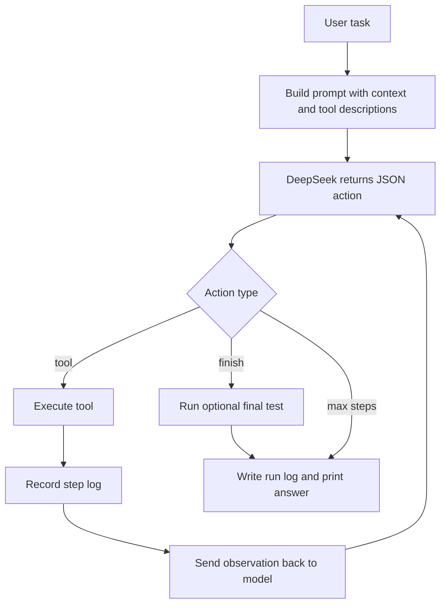
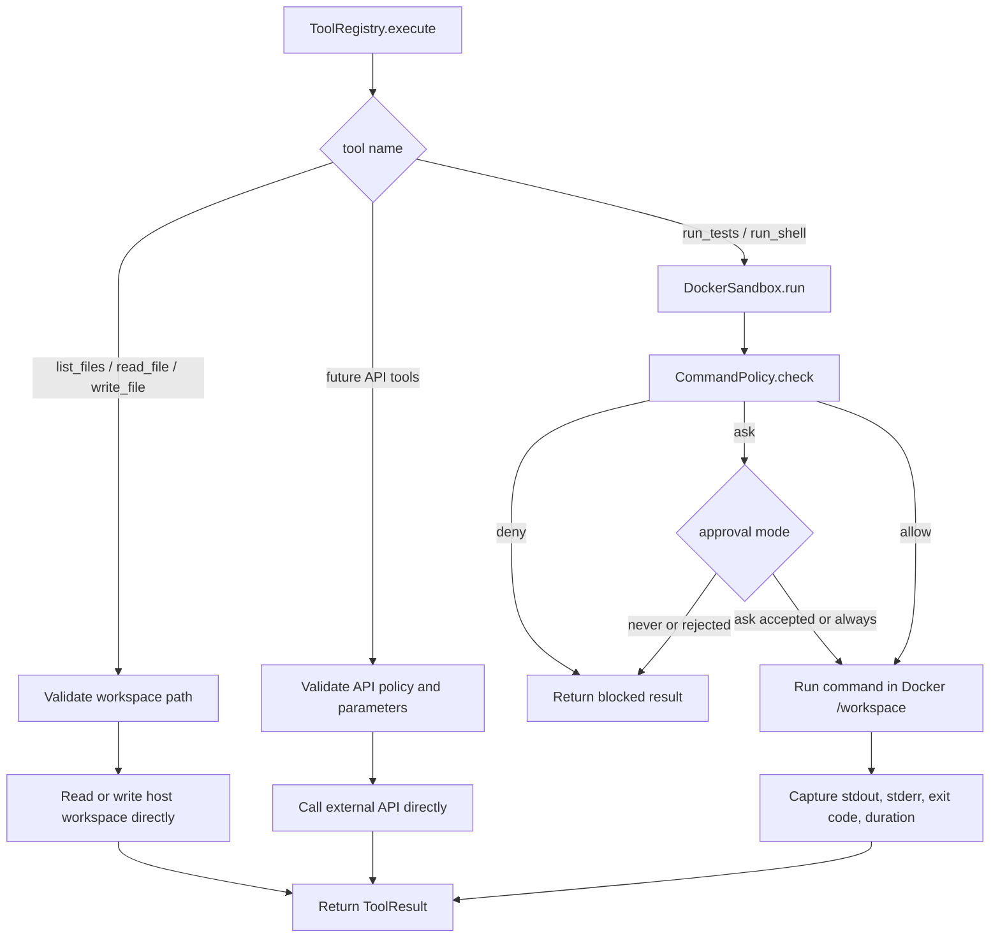

# MiniCode

MiniCode is a minimal Claude Code style coding agent scaffold. The first milestone is intentionally small:

- LLM: DeepSeek API
- Sandbox: Docker CLI
- Agent loop: JSON actions with structured tools and final answer
- Future extension points: context, harness, memory, skills, self-evolution

## Requirements

- Python 3.11+
- Docker
- A DeepSeek API key

## Quick Start

```powershell
$env:DEEPSEEK_API_KEY = "sk-..."
python -m pip install -e .
python -m minicode --check
python -m minicode "inspect the workspace and create a hello.txt file"
```

Or after installing the editable package:

```powershell
minicode "inspect the workspace and create a hello.txt file"
```

## Agent Loop





## Configuration

Environment variables:

- `MINICODE_MODEL`: DeepSeek model name, default `deepseek-v4-flash`
- `DEEPSEEK_API_KEY`: DeepSeek API key
- `MINICODE_DEEPSEEK_URL`: DeepSeek base URL, default `https://api.deepseek.com`
- `MINICODE_LLM_TIMEOUT`: seconds to wait for one LLM response, default `120`
- `MINICODE_MAX_TOKENS`: maximum completion tokens for API providers, default `4096`
- `MINICODE_WORKSPACE`: workspace mounted into Docker, default current directory
- `MINICODE_DOCKER_IMAGE`: sandbox image, default `python:3.12-slim`
- `MINICODE_MAX_STEPS`: agent loop limit, default `8`
- `MINICODE_APPROVAL`: approval mode for risky commands, default `never`
- `MINICODE_RUN_LOG`: optional path for structured run logs
- `MINICODE_FINAL_TEST_COMMAND`: optional command to run after the agent finishes
- `MINICODE_EVAL_OUTPUT`: eval report output path, default `.minicode/eval-report.json`

Example:

```powershell
$env:MINICODE_MODEL = "deepseek-v4-pro"
python -m minicode "list files"
```

Approval modes:

- `never`: block commands that require approval
- `ask`: prompt in the console before running approval-required commands
- `always`: allow approval-required commands without prompting

Example:

```powershell
python -m minicode --approval ask "run tests and fix failures"
```

## Runtime Logs

MiniCode can write a structured JSON log for every agent run:

```powershell
python -m minicode --run-log .minicode/run-log.json --final-test-command "python -m unittest discover -s tests" "fix the failing test"
```

Each step records:

- model input summary
- model action
- tool name and parameters
- permission decision
- stdout, stderr, and exit code
- modified files
- token usage
- elapsed time
- dangerous or invalid commands

If `--final-test-command` is set, the final test result is recorded on the run log.

## Eval

Run the built-in eval suite:

```powershell
python -m minicode --eval --approval never
```

The suite creates isolated workspaces under `.minicode/eval-runs` and measures:

- task success rate
- test pass rate
- average tool calls
- invalid command count
- modified file count
- token usage
- total elapsed time
- dangerous command count

Current eval cases:

- fix a failing unit test
- add an API
- fix a type error
- refactor a function
- add input validation

## Current Tool Protocol

The model must return one JSON object per turn:

```json
{"thought":"short reasoning","action":"list_files","args":{"path":".","max_depth":2}}
```

or:

```json
{"thought":"done","action":"finish","args":{"answer":"summary for the user"}}
```

Available tools:

- `list_files`: list workspace files with `path`, `max_depth`, and `limit`
- `read_file`: read a bounded line range with `path`, `start_line`, and `limit`
- `write_file`: write a workspace file with `path`, `content`, and `overwrite`
- `run_tests`: run a test command in Docker, default `python -m pytest`
- `run_shell`: fallback shell command in Docker
- `finish`: return the final answer

This will evolve into richer context, harness, memory, skill, and self-improvement modules later.
