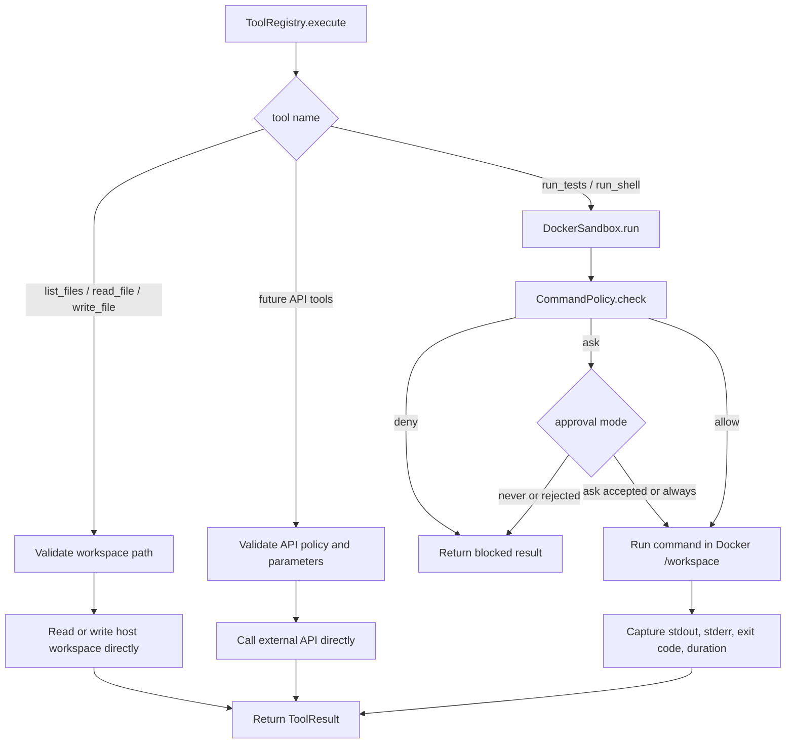
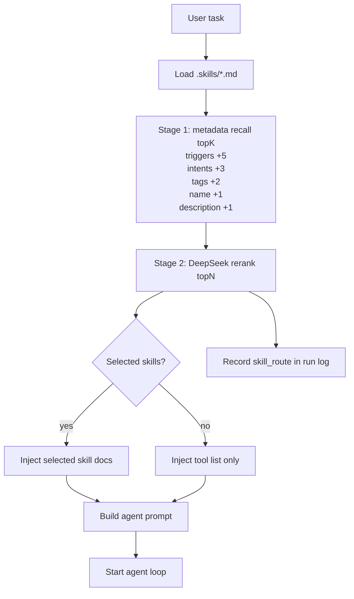

# MiniCode

MiniCode 是一个最小可运行的 coding agent 框架。当前阶段的目标不是一次性做完整智能体，而是先把核心 runtime 跑通：

- LLM：DeepSeek API
- Sandbox：Docker CLI
- Agent loop：模型返回 JSON action，系统执行 tool，再把 observation 回传给模型
- 可观测性：结构化 run log、token、耗时、权限决策、文件修改记录
- Eval：内置一组简单任务，用来衡量后续 Skill、Memory、自我进化是否真的有效

后续还会继续扩展 context、harness、memory、skills 和 self-evolution。

## 运行要求

- Python 3.11+
- Docker
- DeepSeek API Key

## 快速开始

```powershell
$env:DEEPSEEK_API_KEY = "sk-..."
python -m pip install -e .
python -m minicode --check
python -m minicode "inspect the workspace and create a hello.txt file"
```

安装为 editable package 后，也可以直接运行：

```powershell
minicode "inspect the workspace and create a hello.txt file"
```

## Agent Loop

```mermaid
flowchart TD
    A[User query] --> B[Build prompt with context and tool descriptions]
    B --> C[LLM returns JSON action]
    C --> D{Decision}
    D -->|tool call| E[Execute tool]
    E --> F[Record step log]
    F --> G[Send observation back to model]
    G --> C
    D -->|finished| H[Run final test]
    H --> I[Write run log and print answer]
    D -->|max steps| I
```





第一张图是 agent 主循环：用户任务进入后，MiniCode 构建 prompt，DeepSeek 返回一个 JSON action，系统执行对应 tool，并把 observation 再发回模型，直到模型返回 `finish` 或达到最大步数。

第二张图是 tool 执行路径：不是所有 tool 都走 Docker。文件类 tool 直接在本地 workspace 内执行路径校验和读写；`run_shell` / `run_tests` 才会进入 Docker sandbox；未来 API 类 tool 会走自己的 API 参数校验和权限策略。

## 项目文件架构

```text
MiniCode/
  pyproject.toml
  README.md
  .env.example
  .gitignore
  .skills/
    python_test_repair.md
    add_api.md
    refactor_function.md
    input_validation.md
    code_review.md
  minicode/
    __main__.py
    __init__.py
    cli.py
    agent.py
    llm.py
    tools.py
    sandbox.py
    permissions.py
    context.py
    observability.py
    eval.py
    harness.py
    memory.py
    skills/
      __init__.py
      schema.py
      loader.py
      catalog.py
      router.py
      prompt.py
    evolution.py
```

- `pyproject.toml`：Python 项目配置，定义包名、版本、Python 版本要求和 `minicode` 命令行入口。
- `.env.example`：环境变量示例，包含 DeepSeek、Docker、日志和 eval 相关配置。
- `.skills/`：Skill 内容库。这里的 Markdown 文件是给模型看的任务工作流说明，不是 Python 执行代码。
- `.gitignore`：忽略 `.minicode/`、Python 缓存和安装元数据。`.minicode/` 是本机持久运行数据目录，但默认不提交到 Git。
- `minicode/__main__.py`：支持 `python -m minicode` 的入口文件，只负责转发到 CLI。
- `minicode/cli.py`：命令行入口，解析参数，创建 `DeepSeekClient`、`DockerSandbox`、`CodingAgent`，并处理 `--check`、`--eval`、`--run-log` 等模式。
- `minicode/agent.py`：agent 主循环。它负责构建 prompt、调用模型、解析 JSON action、执行 tool、记录 step log，并在结束时运行可选 final test。
- `minicode/llm.py`：DeepSeek API client。调用 OpenAI-compatible `/chat/completions`，返回模型内容、token 用量和耗时。
- `minicode/tools.py`：Tool runtime。注册并执行当前支持的 tools，统一返回 `ToolResult`。
- `minicode/sandbox.py`：Docker sandbox。负责把命令放进 Docker 的 `/workspace` 中执行，并收集 stdout、stderr、exit code、耗时和权限信息。
- `minicode/permissions.py`：命令权限策略。对危险命令做 `allow`、`ask`、`deny` 判断，并支持 `never`、`ask`、`always` 三种审批模式。
- `minicode/context.py`：初始上下文构建，目前会读取 workspace 的基础文件列表。
- `minicode/observability.py`：结构化日志模型。记录每一步的模型输入摘要、action、tool 参数、权限决策、输出、修改文件、token 和耗时。
- `minicode/eval.py`：内置 eval 任务集和指标汇总。用于衡量任务成功率、测试通过率、tool 调用次数、危险命令等。
- `minicode/harness.py`：后续 harness 占位。未来用于自动判断项目类型、运行验证命令和驱动修复循环。
- `minicode/memory.py`：后续 memory 占位。未来用于持久化经验、项目偏好和历史结果。
- `minicode/skills/schema.py`：定义 `Skill`、`SelectedSkill`、`SkillRoute` 等数据结构。
- `minicode/skills/loader.py`：读取 `.skills/*.md`，解析 frontmatter 和正文。
- `minicode/skills/catalog.py`：管理已加载的 skill，提供按名称查询和枚举能力。
- `minicode/skills/router.py`：第一版规则路由器，根据任务文本、triggers、tags、intents 选择相关 skill。
- `minicode/skills/prompt.py`：把选中的 skill 渲染成 prompt 文本，注入给模型。
- `minicode/evolution.py`：后续自我进化占位。未来用于反思失败案例、沉淀策略和生成改进建议。

## Skill 体系

Skill 是给模型看的工作手册，不是可执行函数。Tool 负责真正执行动作，Skill 负责指导模型按什么步骤使用 tools。



当前实现是两阶段路由：

- MiniCode 本地读取 `.skills/*.md`，解析 frontmatter 和正文。
- 第一阶段 `MetadataSkillRetriever` 用任务文本匹配 `triggers`、`tags`、`intents`、skill 名称和 description，粗召回 topK。
- 第二阶段 `LlmSkillRanker` 把候选 skill 的压缩元信息交给 DeepSeek 精排，选出最终注入 prompt 的 topN。
- 如果 LLM 精排失败，会退回本地规则精排并在 run log 的 `rerank_error` 中记录原因。
- 默认最多注入 `2` 个 skill，可用 `--max-skills` 调整。
- 默认粗召回 `8` 个候选，可用 `--skill-recall-k` 调整。
- 没有命中 skill 时，仍然会注入完整 tool 列表，模型依然能调用 tools。
- run log 会记录 `skill_route.recalled`、`skill_route.selected`、`reranker` 和精排 token 用量，方便后续 eval 对比 skill 是否有效。

## 当前支持的 Tools

模型每轮必须返回一个 JSON object，例如：

```json
{"thought":"short reasoning","action":"list_files","args":{"path":".","max_depth":2}}
```

或者结束任务：

```json
{"thought":"done","action":"finish","args":{"answer":"summary for the user"}}
```

当前 tools：

- `list_files`
  - 参数：`path`、`max_depth`、`limit`
  - 作用：列出 workspace 内文件。
  - 执行位置：本地 host workspace。
  - 安全策略：会校验路径不能逃出 workspace。

- `read_file`
  - 参数：`path`、`start_line`、`limit`
  - 作用：读取文件的指定行范围。
  - 执行位置：本地 host workspace。
  - 安全策略：会校验路径不能逃出 workspace。

- `write_file`
  - 参数：`path`、`content`、`overwrite`
  - 作用：写入文件。默认不覆盖已有文件，除非 `overwrite=true`。
  - 执行位置：本地 host workspace。
  - 安全策略：会校验路径不能逃出 workspace。

- `run_tests`
  - 参数：`command`
  - 默认命令：`python -m pytest`
  - 作用：在 Docker sandbox 中运行测试命令。
  - 执行位置：Docker `/workspace`。
  - 安全策略：先经过 `CommandPolicy`，再决定是否执行。

- `run_shell`
  - 参数：`command`
  - 作用：兜底 shell tool，用于结构化 tool 不够用的情况。
  - 执行位置：Docker `/workspace`。
  - 安全策略：先经过 `CommandPolicy`，危险命令会被拒绝或要求审批。

- `finish`
  - 参数：`answer`
  - 作用：结束 agent loop，返回最终答案。
  - 执行位置：不执行外部操作。

## 配置

环境变量：

- `MINICODE_MODEL`：DeepSeek 模型名，默认 `deepseek-v4-flash`
- `DEEPSEEK_API_KEY`：DeepSeek API Key
- `MINICODE_DEEPSEEK_URL`：DeepSeek API base URL，默认 `https://api.deepseek.com`
- `MINICODE_LLM_TIMEOUT`：单次 LLM 响应超时时间，默认 `120`
- `MINICODE_MAX_TOKENS`：API provider 的最大输出 token，默认 `4096`
- `MINICODE_WORKSPACE`：挂载到 Docker 的 workspace，默认当前目录
- `MINICODE_DOCKER_IMAGE`：sandbox 镜像，默认 `python:3.12-slim`
- `MINICODE_MAX_STEPS`：agent 最大循环步数，默认 `8`
- `MINICODE_APPROVAL`：风险命令审批模式，默认 `never`
- `MINICODE_RUN_LOG`：结构化运行日志输出目录或文件路径，默认 `.minicode/runs`
- `MINICODE_FINAL_TEST_COMMAND`：agent 结束后运行的最终测试命令
- `MINICODE_EVAL_OUTPUT`：eval 报告输出路径，默认 `.minicode/eval-report.json`
- `MINICODE_SKILLS_DIR`：Skill Markdown 目录，默认 `.skills`
- `MINICODE_MAX_SKILLS`：每次最多注入的 skill 数量，默认 `2`
- `MINICODE_SKILL_RECALL_K`：精排前粗召回的 skill 候选数量，默认 `8`

示例：

```powershell
$env:MINICODE_MODEL = "deepseek-v4-pro"
python -m minicode "list files"
```

审批模式：

- `never`：需要审批的命令直接阻止
- `ask`：在控制台询问是否允许
- `always`：自动允许需要审批的命令

示例：

```powershell
python -m minicode --approval ask "run tests and fix failures"
```

## 运行日志

MiniCode 默认会为每次运行写一个结构化 JSON 日志。日志是本地持久数据，不会因为下一次运行而覆盖。

```powershell
python -m minicode --final-test-command "python -m unittest discover -s tests" "fix the failing test"
```

默认日志目录：

```text
.minicode/runs/
```

日志文件名会包含时间戳和任务摘要，例如：

```text
.minicode/runs/20260621-221530-fix-the-failing-test.json
```

也可以手动指定目录：

```powershell
python -m minicode --run-log .minicode/my-runs "list files"
```

如果手动指定固定文件名，MiniCode 也不会覆盖旧文件，而是自动追加编号：

```text
.minicode/run-log.json
.minicode/run-log-1.json
.minicode/run-log-2.json
```

每一步会记录：

- 模型输入摘要
- 模型生成的 action
- tool 名称和参数
- 权限决策
- stdout、stderr、exit code
- 修改文件
- token 消耗
- 运行耗时
- 是否出现危险或无效命令

如果设置了 `--final-test-command`，最终测试结果也会写入 run log。

## Eval

运行内置 eval：

```powershell
python -m minicode --eval --approval never
```

eval 会在 `.minicode/eval-runs` 下创建隔离 workspace，并统计：

- 任务成功率
- 测试通过率
- 平均 tool 调用次数
- 无效命令次数
- 修改文件数量
- token 用量
- 总耗时
- 危险命令次数

当前 eval 任务：

- 修复一个失败的单元测试
- 补充一个 API
- 修复类型错误
- 重构一个函数
- 增加输入校验
